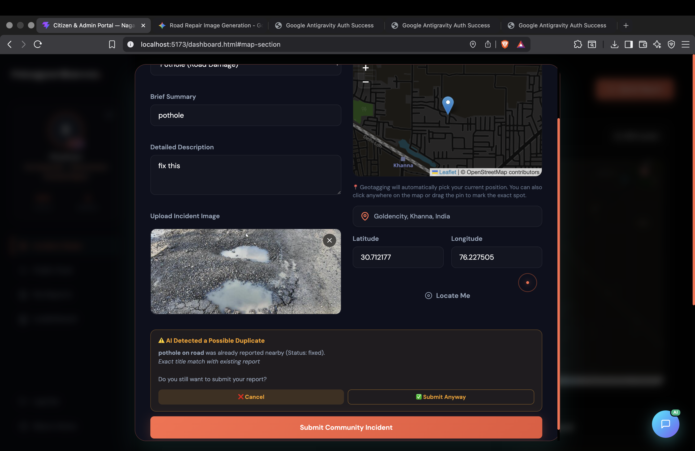

<p align="center">
  
</p>

<h1 align="center">🏛️ NagarSeva</h1>

<p align="center">
  <strong>नगरसेवा — Empowering Citizens. Transforming Cities.</strong>
</p>

<p align="center">
  <a href="#-features"></a>
  <a href="#-tech-stack"></a>
  <a href="#-getting-started"></a>
  <a href="#-architecture"></a>
</p>

<p align="center">
  
  
  
  
  
</p>

---

> **NagarSeva** (नगरसेवा — *"Service to the City"*) is a full-stack civic engagement platform that bridges the gap between citizens and municipal authorities. Citizens can geo-tag and report infrastructure problems like potholes, garbage pile-ups, and water leakages — while administrators track, review, and resolve issues in real-time through a dedicated command center.

---

## ✨ Features

### 🌓 Premium Appearance Theme Toggle
- **Light & Dark Themes**: Switch seamlessly between a high-tech dark mode and a crisp slate-based light mode with optimized readability.
- **Responsive Animations**: Toggle button features custom transitions, animates icons, and changes layout properties smoothly.
- **Theme-Aware Canvas & Maps**: Map tiles restore colorful street maps in light mode, and canvas particles change background color dynamically using computed properties.
- **Zero Flash Load**: Embeds inline checks to load the user's preferred theme instantly before the DOM displays, preventing flashes.

### 🤖 NagBot AI Assistant (Groq-Powered)
- **Strict Personal Report Tracker**: A secure AI chatbot strictly scoped to the logged-in user's own reports.
- **Natural Language Interaction**: Users can ask NagBot about their active, resolved, or under-review reports in plain English.
- **Quick Action Buttons**: Includes one-tap shortcuts (`📋 My Reports`, `✅ Resolved`, `📋 Open`) for instant progress tracking.
- **Secure & Focused**: Politely refuses off-topic queries (coding, general knowledge, or other users' reports) to keep users focused on civic resolutions.
- **Ultra-Fast Performance**: Driven by the lightning-fast **Groq Cloud API** running `llama-3.1-8b-instant`.

### ✨ AI Image Vision Analysis (Groq Llama 3.2 Vision)
- **Auto-Fill Details**: Uploading an image inside the reporting modal instantly triggers vision analysis.
- **Intelligent Classification**: Powered by `llama-3.2-11b-vision-preview` to detect issue categories (potholes, garbage, leakages, or hazards).
- **Pothole/Puddle Smart Rule**: Special prompts ensure rainwater puddles or muddy craters in roads are correctly flagged as *potholes* rather than pipe *leakages*.
- **Visual Highlight**: Smooth green-glowing animation indicates auto-completed select boxes, titles, and descriptions.

### 🎙️ Web Speech Voice Reporting
- **On-the-Fly Speech Dictation**: Microphones added next to Title and Description inputs allow hands-free reporting.
- **Pulsating Recording Status**: Live banner notifications (`Listening... Speak now` / `सुन रहा हूँ... अब बोलें`) keep user informed.
- **Bilingual Dictation**: Adapts to the active interface language (English or Hindi Speech Engine).

### 🌐 Multilingual English & Hindi Support (i18n)
- **Instant Switcher**: Seamless switcher in the sidebar navigation header (EN / हिंदी).
- **Full Localization**: Translates headings, form labels, selects, feedback banners, placeholers, and bot states dynamically without reloading.

### 📍 "Near Me" GPS Proximity Sorting
- **Distance-Based Filtering**: Toggle feed sorting between `Latest` and `Near Me`.
- **Haversine Distance Mapping**: Pinpoints citizen GPS position to calculate physical proximity in real-time.
- **Proximity Badges**: Attaches a clean mileage tag (e.g. `📍 0.4 km away` / `📍 0.4 km दूर`) on activity cards.

### 🗺️ Interactive GPS-Powered Map
- Auto-locates the user on load and centers the Leaflet map on their GPS coordinates.
- Citizens can click anywhere to drop a pin and instantly file a new report.
- Map heatmap shows areas with high report density — clicking a cluster navigates to that zone.
- **Admin dashboard** map is clickable — redirects to areas with the most active reports.

### 📝 Instant Report Submission
- One-tap modal to report **Pothole**, **Garbage**, **Water Leakage**, or **General Hazard**.
- Photo upload with live preview — images stored in Supabase Storage buckets.
- Auto-attaches GPS coordinates and timestamp to every submission.

### 🔑 Flexible Authentication
- **Google OAuth** single-click sign-in.
- Traditional **Email / Username + Password** login & signup.
- Session persistence via `localStorage` with automatic role detection.

### 🛡️ Command Center & Profiles
- Admin portal with status workflow: **Reported** → **Under Review** → **Resolved** with comments and fix verification photos.
- User profile modals listing citizen level, points, badges, bio, and all submitted reports.

---

## 🛠️ Tech Stack

| Layer | Technology |
|---|---|
| **Frontend** | HTML5, Vanilla CSS3 (Glassmorphic design system), JavaScript (ES6 Modules) |
| **Maps** | Leaflet.js with OpenStreetMap tile layers |
| **Backend & DB** | Supabase (PostgreSQL, Real-time subscriptions, Auth, Storage) |
| **Build Tool** | Vite (HMR + ESM dev server) |
| **Hosting** | Any static host (Vercel, Netlify, GitHub Pages) |

---

## 🧩 Architecture

```
NagarSeva/
├── index.html              # Landing page — hero section, features, testimonials
├── dashboard.html          # Citizen & Admin portal (SPA-style with JS routing)
├── src/
│   ├── main.js             # Landing page animations, particles, scroll effects
│   ├── dashboard.js        # Core portal logic — map, reports, auth, admin panel
│   ├── api.js              # Supabase client, CRUD operations, storage, auth helpers
│   ├── style.css           # Global design system — dark theme, glassmorphism
│   └── dashboard.css       # Portal-specific layout, sidebar, cards, modals
├── public/
│   └── favicon.svg         # App icon
├── .env                    # Supabase credentials (not committed)
├── package.json
└── vite.config.js
```

**Data Flow:**
```
Citizen App                    Supabase Backend                Admin Portal
┌─────────────┐    submit     ┌──────────────────┐    fetch    ┌─────────────┐
│  Report Form │──────────────▶│  reports table   │◀────────────│  Admin View │
│  + Photo     │              │  + storage bucket │             │  + Actions  │
└─────────────┘              └──────────────────┘             └─────────────┘
       │                            │                               │
       │        real-time           │          status update        │
       └────────◀───────────────────┘◀──────────────────────────────┘
```

---

## ⚡ Getting Started

### 📋 Prerequisites

- [Node.js](https://nodejs.org/) **v18+**
- A [Supabase](https://supabase.com/) project (free tier works perfectly)

### 🚀 Quick Start

```bash
# 1. Clone the repository
git clone https://github.com/roshandhiman/NagarSeva.git
cd NagarSeva

# 2. Install dependencies
npm install

# 3. Configure environment
cp .env.example .env
# Edit .env with your Supabase credentials

# 4. Launch development server
npm run dev
```

### 🔐 Environment Variables

Create a `.env` file in the project root:

```env
VITE_SUPABASE_URL=https://your-project.supabase.co
VITE_SUPABASE_ANON_KEY=your_supabase_anon_key
VITE_GROQ_API_KEY=your_groq_api_key_here
```

---

## 🗄️ Database Setup

Execute the following SQL in the **Supabase SQL Editor** to create the required schema:

```sql
-- ══════════════════════════════════════════════
-- 1. USERS TABLE
-- ══════════════════════════════════════════════
CREATE TABLE public.users (
  user_id UUID PRIMARY KEY,
  username TEXT NOT NULL,
  email TEXT,
  points INTEGER DEFAULT 50,
  badges TEXT[] DEFAULT '{First Responder}'::TEXT[],
  created_at TIMESTAMP WITH TIME ZONE DEFAULT timezone('utc'::text, now())
);

-- ══════════════════════════════════════════════
-- 2. REPORTS TABLE
-- ══════════════════════════════════════════════
CREATE TABLE public.reports (
  id UUID PRIMARY KEY DEFAULT gen_random_uuid(),
  title TEXT NOT NULL,
  type TEXT NOT NULL,
  description TEXT,
  latitude DOUBLE PRECISION NOT NULL,
  longitude DOUBLE PRECISION NOT NULL,
  photo_url TEXT,
  status TEXT DEFAULT 'reported',
  timestamp BIGINT,
  user_id UUID REFERENCES public.users(user_id),
  username TEXT NOT NULL
);

-- ══════════════════════════════════════════════
-- 3. ROW LEVEL SECURITY (RLS)
-- ══════════════════════════════════════════════
ALTER TABLE public.users ENABLE ROW LEVEL SECURITY;
ALTER TABLE public.reports ENABLE ROW LEVEL SECURITY;

CREATE POLICY "Allow public read access on users"
  ON public.users FOR SELECT USING (true);
CREATE POLICY "Allow public insert access on users"
  ON public.users FOR INSERT WITH CHECK (true);
CREATE POLICY "Allow public update access on users"
  ON public.users FOR UPDATE USING (true);

CREATE POLICY "Allow public read access on reports"
  ON public.reports FOR SELECT USING (true);
CREATE POLICY "Allow public insert access on reports"
  ON public.reports FOR INSERT WITH CHECK (true);
CREATE POLICY "Allow public update access on reports"
  ON public.reports FOR UPDATE USING (true);

-- ══════════════════════════════════════════════
-- 4. STORAGE BUCKET
-- ══════════════════════════════════════════════
INSERT INTO storage.buckets (id, name, public)
  VALUES ('community_hero_bucket', 'community_hero_bucket', true);

CREATE POLICY "Allow public read on bucket"
  ON storage.objects FOR SELECT
  USING (bucket_id = 'community_hero_bucket');

CREATE POLICY "Allow public upload on bucket"
  ON storage.objects FOR INSERT
  WITH CHECK (bucket_id = 'community_hero_bucket');
```

---

## 🔑 Default Credentials

| Role | Username | Password |
|---|---|---|
| **Admin** | `admin` | `admin` |
| **Citizen** | Sign up via the portal | — |

> **Note:** Admin credentials are for local development only. In production, configure proper role-based access through Supabase Auth.

---

## 🖼️ Interface Preview

### 🤖 Groq AI Assistant & Smart Anti-Duplicate Engine
> Active duplicate inspection warning banner triggered on report submission coordinates matching existing reports, alongside the floating NagBot chat bubble.

<p align="center">
  
</p>

### 🌐 Landing Page
> Particle constellation background, animated typography, scroll-reveal sections, and a live mockup feed showcasing the platform's capabilities.

### 📊 Citizen Dashboard
> Interactive GPS map with incident markers, report submission modal with photo upload, live activity feed, gamified leaderboard, and profile management.

### 🛡️ Admin Command Center
> Comprehensive ticket management grid with status transitions, resolution comments, fix photo attachments, and real-time report monitoring across the city.

---

## 🤝 Contributing

1. Fork the repository
2. Create your feature branch (`git checkout -b feature/amazing-feature`)
3. Commit your changes (`git commit -m 'Add amazing feature'`)
4. Push to the branch (`git push origin feature/amazing-feature`)
5. Open a Pull Request

---

<p align="center">
  <sub>Built with ❤️ for smarter, safer cities.</sub>
</p>
